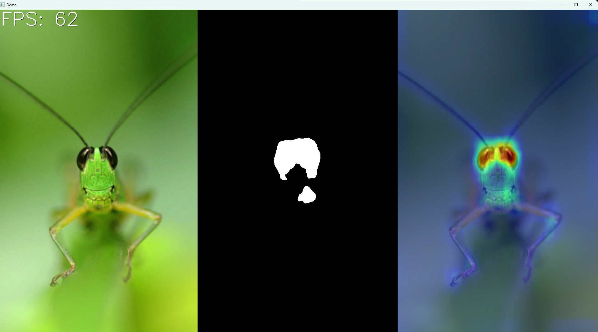

# saliency_display

## 説明
これはカメラ映像から顕著性検出を行い、画面に出力するものです。


## 使い方
`saliency.yml` をcondaで再構築するか以下のパッケージをインストールする。

```
opencv-python
opencv-contrib-python
```

`python main.py` で実行。

終了するときは、ウィンドウを選択状態で`Esc`を押す。

※カメラまたは仮想カメラを検出できないとき、エラーで終了します。

## 設定ファイルの説明

### 顕著性検出アルゴリズム
デフォルト: `SR`

`SR`: このアルゴリズムは、入力画像の対数スペクトルを分析し、スペクトルドメイン内の画像のスペクトル残差を抽出し、プロトオブジェクトの位置を示唆する顕著性マップを構築する高速な方法が実装されています。

`FG`: 人間の目の網膜は神経節細胞で構成されています。 神経節細胞には、オンセンターとオフセンターの2種類があります。 オンセンターは、暗い背景に囲まれた明るい領域に反応します。 オフセンターは、明るい背景に囲まれた暗い領域に反応します。

> [!NOTE]
> 参考元: 
> [OpenCVで顕著性検出(Saliency Detection)](https://data-analysis-stats.jp/%E6%B7%B1%E5%B1%9E%E5%AD%A6%E7%BF%92/opencv%E3%81%A7%E9%A1%95%E8%91%97%E6%80%A7%E6%A4%9C%E5%87%BAsaliency-detection/)

### FPS表示

デフォルト: `True`

### スレッショルド表示

デフォルト: `True`

### ヒートマップと元映像の合成割合

デフォルト: `0.5`

`0`: 元映像  
`1`: ヒートマップのみ